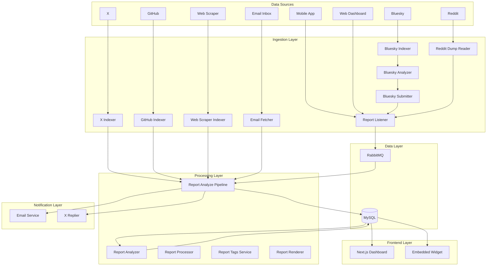

# CleanApp Backend Architecture

> Last updated: December 17, 2025

## Overview

CleanApp is a microservices-based platform for crowdsourced feedback & reporting. Users submit reports about issues (litter, hazards, digital product complaints), which are analyzed by AI, clustered with similar reports, and automatically routed to relevant stakeholders.



---

## Service Inventory

### Core Infrastructure

| Service | Port | Purpose |
|---------|------|---------|
| `cleanapp_db` | 3306 | MySQL 8 database |
| `cleanapp_rabbitmq` | 5672, 15672 | Message queue |
| `cleanapp_service` | 8080 | Main API (legacy) |
| `cleanapp_pipelines` | 8090 | Scheduled jobs |

### Report Processing

| Service | Port | Language | Purpose |
|---------|------|----------|---------|
| `cleanapp_report_listener` | 9081 | Go | Receives reports via REST API |
| `cleanapp_report_listener_v4` | 9099 | Go | Updated listener with bulk ingest |
| `cleanapp_report_analyze_pipeline` | 9082 | Go | AI analysis (Gemini/OpenAI) |
| `cleanapp_report_processor` | 9087 | Go | Additional processing logic |
| `cleanapp_report_renderer_service` | 9093 | Rust | Image generation |
| `cleanapp_report_tags_service` | 9098 | Rust | Tag management |
| `cleanapp_report_ownership_service` | 9090 | Go | Report assignment |

### Social Media & Web Indexing

| Service | Language | Pipeline Stage |
|---------|----------|----------------|
| `cleanapp_news_indexer_x` | Rust | Fetch X posts |
| `cleanapp_news_analyzer_x` | Rust | AI analysis |
| `cleanapp_news_submitter_x` | Rust | Submit as reports |
| `cleanapp_replier_x` | Rust | Auto-reply on X |
| `cleanapp_bluesky_indexer` | Rust | Fetch Bluesky posts |
| `cleanapp_bluesky_analyzer` | Rust | AI analysis |
| `cleanapp_bluesky_submitter` | Rust | Submit as reports |
| `bluesky_now` | Rust | Real-time Bluesky firehose |
| `cleanapp_report_analyzer` | Rust | AI enrichment for bulk-ingested reports (brand extraction, summaries) |
| `cleanapp_github_indexer` | Rust | Fetch GitHub issues |
| `cleanapp_reddit_dump_reader` | Rust | Process Reddit data dumps |
| `cleanapp_web_scraper` | Rust | Web complaint scraping |

### Notifications

| Service | Port | Language | Purpose |
|---------|------|----------|---------|
| `cleanapp_email_service` | 9089 | Go | Aggregate brand notifications |
| `cleanapp_email_fetcher` | - | Rust | Inbound email processing |

### Frontends

| Service | Port | Stack |
|---------|------|-------|
| `cleanapp_frontend` | 3001 | Next.js 14 + TypeScript |
| `cleanapp_frontend_embedded` | 3002 | Next.js (embeddable) |
| `cleanapp_web` | 3000 | Legacy React app |

### Dashboards

| Service | Port | Purpose |
|---------|------|---------|
| `cleanapp_areas_service` | 9086 | Area management API |
| `cleanapp_montenegro_areas` | 9083 | Montenegro dashboard |
| `cleanapp_new_york_areas` | 9088 | NYC dashboard |
| `cleanapp_devconnect_2025_areas` | 9094 | Event dashboard |
| `cleanapp_edge_city_areas` | 9095 | Event dashboard |
| `cleanapp_red_bull_dashboard` | 9085 | Brand dashboard |

### Auth & User Management

| Service | Port | Purpose |
|---------|------|---------|
| `cleanapp_auth_service` | 9084 | JWT auth, password reset |
| `cleanapp_customer_service` | 9080 | Subscriptions, Stripe |
| `cleanapp_gdpr_process_service` | 9091 | Data deletion |
| `cleanapp_voice_assistant_service` | 9092 | Voice reports |

---

## Data Flow

### Physical Report Submission
```
Mobile App → Report Listener → RabbitMQ → Analyze Pipeline → DB
                                              ↓
                                        Email Service → SendGrid
```

### Digital Report (Social Media / Web)
```
X/Bluesky/GitHub/Web → Indexer → Analyzer → Submitter → Report Listener V4 → DB
                                                               ↓
                                                         Email Service
```

### Report Analysis
```
New Report → Gemini/OpenAI API → Extract:
  - Brand name
  - Severity (0-1)
  - Classification (physical/digital)
  - Inferred contact emails
  - Legal risk estimate
```

---

## Database Schema (Key Tables)

| Table | Purpose |
|-------|---------|
| `reports` | All submitted reports |
| `report_analysis` | AI-generated analysis |
| `users` | User accounts |
| `areas` | Geographic areas |
| `area_index` | Report ↔ Area mapping |
| `contact_emails` | Area contact info |
| `sent_reports_emails` | Processed email tracking |
| `brand_email_throttle` | Per-brand rate limiting |
| `external_ingest_index` | Deduplication for external sources |

---

## Deployment

### Infrastructure
- **Cloud**: Google Cloud Platform
- **VMs**: Compute Engine (dev: 34.132.121.53, prod: 34.122.15.16)
- **Container Registry**: Artifact Registry (us-central1)
- **Secrets**: Google Secret Manager

### Deployment Process
```bash
# Build & tag image
./build_image.sh -e dev

# Deploy via setup.sh (generates docker-compose, SSHs to VM)
./setup.sh -e prod --ssh-keyfile ~/.ssh/id_ed25519
```

### Environment Variables (via Secret Manager)
- `MYSQL_ROOT_PASSWORD_*`
- `SENDGRID_API_KEY_*`
- `GEMINI_API_KEY_*`
- `X_BEARER_TOKEN_*`
- `STRIPE_SECRET_KEY_*`

---

## Known Limitations

1. **Single database** - All services share one MySQL instance
2. **No auto-scaling** - Manual VM management
3. **No service mesh** - Direct container networking
4. **Limited observability** - Basic Docker logs only
5. **Container conflicts** - Docker Compose naming collisions on redeploy

---

## Future Improvements

- [ ] Kubernetes migration for orchestration
- [ ] Per-service databases where appropriate
- [ ] Centralized logging (ELK/Loki)
- [ ] Distributed tracing (Jaeger)
- [ ] API gateway (Kong/Envoy)
- [ ] CI/CD pipeline (GitHub Actions → Cloud Build)
