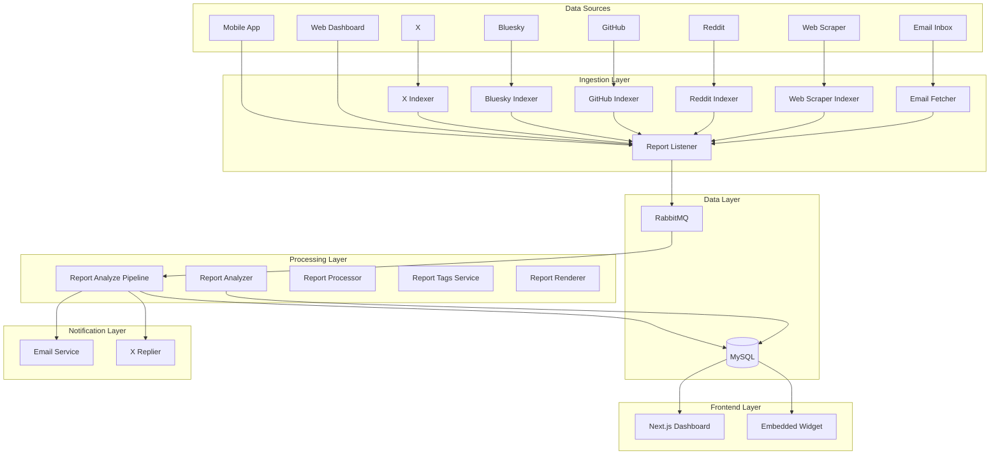
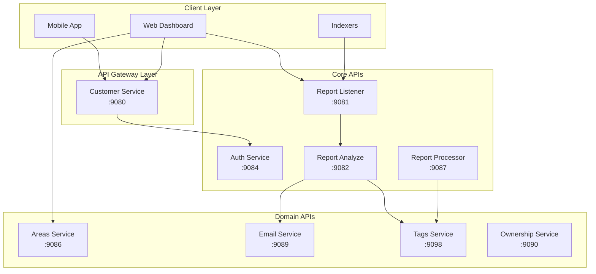
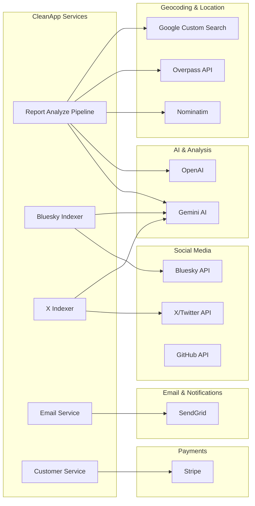

# CleanApp Backend Architecture

> Last updated: December 17, 2025

## Overview

CleanApp is a microservices-based platform for crowdsourced feedback & reporting. Users submit reports about issues (litter, hazards, digital product complaints), which are analyzed by AI, clustered with similar reports, and automatically routed to relevant stakeholders.



---

## CleanApp Internal APIs

CleanApp exposes multiple REST APIs across its microservices. All modern APIs use the `/api/v3` prefix.



### API Endpoints by Service

#### Auth Service (`:9084`)
| Method | Endpoint | Description |
|--------|----------|-------------|
| POST | `/api/v3/auth/login` | User login, returns JWT |
| POST | `/api/v3/auth/register` | Create new user account |
| POST | `/api/v3/auth/refresh` | Refresh JWT token |
| POST | `/api/v3/auth/logout` | 🔒 Invalidate session |
| POST | `/api/v3/auth/forgot-password` | Send password reset email |
| POST | `/api/v3/auth/reset-password` | Reset password with token |
| POST | `/api/v3/validate-token` | Validate JWT (for services) |
| GET | `/api/v3/users/me` | 🔒 Get current user profile |
| PUT | `/api/v3/users/me` | 🔒 Update current user |
| GET | `/api/v3/users/:id` | Get user by ID (internal) |
| GET | `/api/v3/users/exists` | Check if email exists |

#### Report Listener (`:9081`)
| Method | Endpoint | Description |
|--------|----------|-------------|
| GET | `/api/v3/reports/listen` | WebSocket for real-time reports |
| GET | `/api/v3/reports/last` | Get last N analyzed reports |
| GET | `/api/v3/reports/by-seq` | Get report by sequence ID |
| GET | `/api/v3/reports/by-id` | Get reports by report ID |
| GET | `/api/v3/reports/by-latlng` | Get reports within radius |
| GET | `/api/v3/reports/by-latlng-lite` | Lightweight geo query |
| GET | `/api/v3/reports/by-brand` | Get reports for a brand |
| GET | `/api/v3/reports/search` | Search reports by keyword |
| GET | `/api/v3/reports/image` | Get processed image |
| GET | `/api/v3/reports/rawimage` | Get original image |
| POST | `/api/v3/reports/bulk_ingest` | 🔑 Bulk ingest reports (indexers) |

#### Report Analyze Pipeline (`:9082`)
| Method | Endpoint | Description |
|--------|----------|-------------|
| POST | `/api/v3/analysis` | Analyze a report with AI |
| GET | `/api/v3/health` | Service health check |

#### Customer Service (`:9080`)
| Method | Endpoint | Description |
|--------|----------|-------------|
| POST | `/api/v3/auth/*` | Proxies to Auth Service |
| GET | `/api/v3/subscription` | 🔒 Get user subscription |
| POST | `/api/v3/checkout` | 🔒 Create Stripe checkout |
| POST | `/api/v3/portal` | 🔒 Create Stripe portal session |
| POST | `/api/v3/webhooks/stripe` | Stripe webhook handler |

#### Areas Service (`:9086`)
| Method | Endpoint | Description |
|--------|----------|-------------|
| GET | `/api/v3/get_areas` | Get all defined areas |
| GET | `/api/v3/areas/:id` | Get area by ID |
| GET | `/api/v3/areas/:id/reports` | Get reports in area |

#### Email Service (`:9089`)
| Method | Endpoint | Description |
|--------|----------|-------------|
| POST | `/api/v3/optout` | Process email opt-out |
| GET | `/opt-out` | Opt-out landing page |
| GET | `/api/v3/send-digest` | Trigger brand digest emails |

#### Tags Service (`:9098`)
| Method | Endpoint | Description |
|--------|----------|-------------|
| GET | `/api/v3/reports/:seq/tags` | Get tags for a report |
| POST | `/api/v3/reports/:seq/tags` | Add tags to a report |

### Authentication

- 🔒 = Requires JWT Bearer token
- 🔑 = Requires Fetcher token (for indexers)
- All other endpoints are public

### Base URLs

| Environment | Base URL |
|-------------|----------|
| Production | `https://api.cleanapp.io` |
| Development | `https://api-dev.cleanapp.io` |
| Local | `http://localhost:<port>` |

---

## External APIs

CleanApp integrates with multiple third-party APIs for AI analysis, geocoding, email delivery, and social media indexing.



### API Reference Table

| API | Base URL | Purpose | Rate Limit | Auth |
|-----|----------|---------|------------|------|
| **Gemini AI** | `generativelanguage.googleapis.com` | Report analysis, brand extraction, summaries | 60 req/min | API Key |
| **OpenAI** | `api.openai.com` | Report analysis (fallback), voice assistant | Usage-based | API Key |
| **Nominatim** | `nominatim.openstreetmap.org` | Reverse geocoding for physical report locations | 1 req/sec | None (User-Agent required) |
| **Overpass API** | `overpass-api.de/api` | Query nearby POIs (schools, businesses) | ~10K/day | None |
| **Google Custom Search** | `googleapis.com/customsearch/v1` | Location email discovery fallback | 1000/day (configurable) | API Key + CSE ID |
| **SendGrid** | `api.sendgrid.com` | Transactional email delivery to brands | 100/day free | API Key |
| **X/Twitter API** | `api.twitter.com/2` | Index tweets mentioning app issues | 500K tweets/mo | Bearer Token |
| **Bluesky API** | `bsky.social/xrpc` | Index posts mentioning app issues | None | App Password |
| **GitHub API** | `api.github.com` | Index issues from public repos | 5000 req/hr | None (or PAT) |
| **Stripe** | `api.stripe.com` | Subscription payments | None | Secret Key |

### Environment Variables

| Variable | Description |
|----------|-------------|
| `GEMINI_API_KEY` | Google AI Studio API key |
| `OPENAI_API_KEY` | OpenAI platform API key |
| `GOOGLE_SEARCH_API_KEY` | Google Cloud API key (Custom Search enabled) |
| `GOOGLE_SEARCH_CX` | Custom Search Engine ID |
| `GOOGLE_SEARCH_DAILY_LIMIT` | Max searches/day (default: 1000) |
| `SENDGRID_API_KEY` | SendGrid API key |
| `X_BEARER_TOKEN` | Twitter API v2 bearer token |
| `BSKY_IDENTIFIER` / `BSKY_APP_PASSWORD` | Bluesky credentials |
| `STRIPE_SECRET_KEY` | Stripe secret key |

---

## Service Inventory

### Core Infrastructure

| Service | Port | Purpose |
|---------|------|---------|
| `cleanapp_db` | 3306 | MySQL 8 database |
| `cleanapp_rabbitmq` | 5672, 15672 | Message queue |
| `cleanapp_service` | 8080 | Main API (legacy) |
| `cleanapp_pipelines` | 8090 | Scheduled jobs |

### Report Processing

| Service | Port | Language | Purpose |
|---------|------|----------|---------|
| `cleanapp_report_listener` | 9081 | Go | Receives reports via REST API |
| `cleanapp_report_listener_v4` | 9099 | Go | Updated listener with bulk ingest |
| `cleanapp_report_analyze_pipeline` | 9082 | Go | AI analysis (Gemini/OpenAI) |
| `cleanapp_report_processor` | 9087 | Go | Additional processing logic |
| `cleanapp_report_renderer_service` | 9093 | Rust | Image generation |
| `cleanapp_report_tags_service` | 9098 | Rust | Tag management |
| `cleanapp_report_ownership_service` | 9090 | Go | Report assignment |

### Social Media & Web Indexing

| Service | Language | Pipeline Stage |
|---------|----------|----------------|
| `cleanapp_news_indexer_x` | Rust | Fetch X posts |
| `cleanapp_news_analyzer_x` | Rust | AI analysis |
| `cleanapp_news_submitter_x` | Rust | Submit as reports |
| `cleanapp_replier_x` | Rust | Auto-reply on X |
| `cleanapp_bluesky_indexer` | Rust | Fetch Bluesky posts |
| `cleanapp_bluesky_analyzer` | Rust | AI analysis |
| `cleanapp_bluesky_submitter` | Rust | Submit as reports |
| `bluesky_now` | Rust | Real-time Bluesky firehose |
| `cleanapp_report_analyzer` | Rust | AI enrichment for bulk-ingested reports (brand extraction, summaries) |
| `cleanapp_github_indexer` | Rust | Fetch GitHub issues |
| `cleanapp_reddit_dump_reader` | Rust | Process Reddit data dumps |
| `cleanapp_web_scraper` | Rust | Web complaint scraping |

### Notifications

| Service | Port | Language | Purpose |
|---------|------|----------|---------|
| `cleanapp_email_service` | 9089 | Go | Aggregate brand notifications |
| `cleanapp_email_fetcher` | - | Rust | Inbound email processing |

### Frontends

| Service | Port | Stack |
|---------|------|-------|
| `cleanapp_frontend` | 3001 | Next.js 14 + TypeScript |
| `cleanapp_frontend_embedded` | 3002 | Next.js (embeddable) |
| `cleanapp_web` | 3000 | Legacy React app |

### Dashboards

| Service | Port | Purpose |
|---------|------|---------|
| `cleanapp_areas_service` | 9086 | Area management API |
| `cleanapp_montenegro_areas` | 9083 | Montenegro dashboard |
| `cleanapp_new_york_areas` | 9088 | NYC dashboard |
| `cleanapp_devconnect_2025_areas` | 9094 | Event dashboard |
| `cleanapp_edge_city_areas` | 9095 | Event dashboard |
| `cleanapp_red_bull_dashboard` | 9085 | Brand dashboard |

### Auth & User Management

| Service | Port | Purpose |
|---------|------|---------|
| `cleanapp_auth_service` | 9084 | JWT auth, password reset |
| `cleanapp_customer_service` | 9080 | Subscriptions, Stripe |
| `cleanapp_gdpr_process_service` | 9091 | Data deletion |
| `cleanapp_voice_assistant_service` | 9092 | Voice reports |

---

## Data Flow

### Physical Report Submission
```
Mobile App → Report Listener → RabbitMQ → Analyze Pipeline → DB
                                              ↓
                                        Email Service → SendGrid
```

### Digital Report (Social Media / Web)
```
X/Bluesky/GitHub/Web → Indexer → Analyzer → Submitter → Report Listener V4 → DB
                                                               ↓
                                                         Email Service
```

### Report Analysis
```
New Report → Gemini/OpenAI API → Extract:
  - Brand name
  - Severity (0-1)
  - Classification (physical/digital)
  - Inferred contact emails
  - Legal risk estimate
```

---

## Database Schema (Key Tables)

| Table | Purpose |
|-------|---------|
| `reports` | All submitted reports |
| `report_analysis` | AI-generated analysis |
| `users` | User accounts |
| `areas` | Geographic areas |
| `area_index` | Report ↔ Area mapping |
| `contact_emails` | Area contact info |
| `sent_reports_emails` | Processed email tracking |
| `brand_email_throttle` | Per-brand rate limiting |
| `external_ingest_index` | Deduplication for external sources |

---

## Deployment

### Infrastructure
- **Cloud**: Google Cloud Platform
- **VMs**: Compute Engine (dev: 34.132.121.53, prod: 34.122.15.16)
- **Container Registry**: Artifact Registry (us-central1)
- **Secrets**: Google Secret Manager

### Deployment Process
```bash
# Build & tag image
./build_image.sh -e dev

# Deploy via setup.sh (generates docker-compose, SSHs to VM)
./setup.sh -e prod --ssh-keyfile ~/.ssh/id_ed25519
```

### Environment Variables (via Secret Manager)
- `MYSQL_ROOT_PASSWORD_*`
- `SENDGRID_API_KEY_*`
- `GEMINI_API_KEY_*`
- `X_BEARER_TOKEN_*`
- `STRIPE_SECRET_KEY_*`

---

## Known Limitations

1. **Single database** - All services share one MySQL instance
2. **No auto-scaling** - Manual VM management
3. **No service mesh** - Direct container networking
4. **Limited observability** - Basic Docker logs only
5. **Container conflicts** - Docker Compose naming collisions on redeploy

---

## Future Improvements

- [ ] Kubernetes migration for orchestration
- [ ] Per-service databases where appropriate
- [ ] Centralized logging (ELK/Loki)
- [ ] Distributed tracing (Jaeger)
- [ ] API gateway (Kong/Envoy)
- [ ] CI/CD pipeline (GitHub Actions → Cloud Build)
