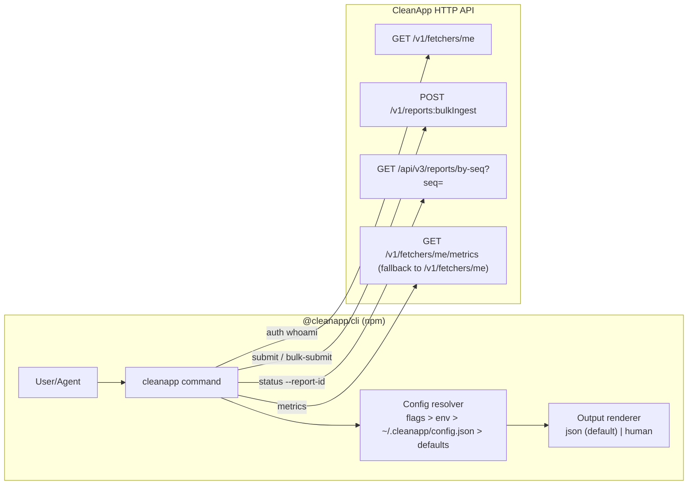

# CleanApp Backend Architecture

> Last updated: February 16, 2026

## Overview

CleanApp is a microservices-based platform for crowdsourced feedback & reporting. Users submit reports about issues (litter, hazards, digital product complaints), which are analyzed by AI, clustered with similar reports, and automatically routed to relevant stakeholders (via email, social notifications, DMs, and (soon) direct automated phone calls if necessary to escalate a given issue).

### The Pipeline at a Glance

```
┌─────────────┐    ┌─────────────┐    ┌─────────────┐    ┌─────────────┐
│ 1. INGEST   │ →  │ 2. STORE    │ →  │ 3. ANALYZE  │ →  │ 4. DISPATCH │
│             │    │             │    │             │    │             │
│ Collect     │    │ Queue &     │    │ AI Process  │    │ Notify      │
│ Reports     │    │ Persist     │    │ & Enrich    │    │ Stakeholders│
└─────────────┘    └─────────────┘    └─────────────┘    └─────────────┘
```

### Detailed Architecture

```mermaid
graph LR
    %% Stage 1: INGESTION (Green)
    subgraph STAGE1["① INGESTION"]
        direction TB
        subgraph "Data Sources"
            APP[📱 Mobile App]
            WEB[🌐 Web Dashboard]
        end
        subgraph "Social Indexers"
            XI[X Indexer]
            BI[Bluesky Indexer]
            GHI[GitHub Indexer]
            RDI[Reddit Indexer]
        end
        subgraph "Other Inputs"
            WSI[Web Scraper]
            EF[Email Fetcher]
        end
    end

    %% Stage 2: STORAGE (Blue)
    subgraph STAGE2["② STORAGE"]
        direction TB
        RL[Report Listener]
        RMQ[(RabbitMQ)]
        DB[(MySQL)]
    end

    %% Stage 3: ANALYSIS (Orange)
    subgraph STAGE3["③ ANALYSIS & ENRICHMENT"]
        direction TB
        RAP[Report Analyze Pipeline]
        subgraph "AI Processing"
            GEMINI[🤖 Gemini AI]
            BRAND[Brand Extraction]
            CONTACT[Contact Discovery]
        end
        subgraph "Geo Enrichment"
            OSM[Nominatim/Overpass]
            GSEARCH[Google Search]
        end
    end

    %% Stage 4: DISPATCH (Purple)
    subgraph STAGE4["④ DISPATCH"]
        direction TB
        ES[📧 Email Service]
        XR[🐦 X Replier]
        VOICE[📞 Voice Assistant]
    end

    %% Stage 5: FRONTEND (Gray)
    subgraph STAGE5["DASHBOARDS"]
        FE[Next.js Dashboard]
        EMBED[Embedded Widget]
        BRAND_DASH[Brand Dashboard]
    end

    %% Flow connections
    APP --> RL
    WEB --> RL
    XI --> RL
    BI --> RL
    GHI --> RL
    RDI --> RL
    WSI --> RL
    EF --> RL

    RL --> RMQ
    RL --> DB
    RMQ --> RAP
    
    RAP --> GEMINI
    RAP --> OSM
    RAP --> GSEARCH
    RAP --> DB
    
    RAP --> ES
    RAP --> XR
    
    DB --> FE
    DB --> EMBED
    DB --> BRAND_DASH

    %% Styling
    style STAGE1 fill:#1a4d1a,stroke:#2d8a2d,color:#fff
    style STAGE2 fill:#1a3d5c,stroke:#2d6da8,color:#fff
    style STAGE3 fill:#5c3d1a,stroke:#a86d2d,color:#fff
    style STAGE4 fill:#3d1a5c,stroke:#6d2da8,color:#fff
    style STAGE5 fill:#3d3d3d,stroke:#666,color:#fff
```



### Pipeline Stages Explained

| Stage | Purpose | Key Services | Data Flow |
|-------|---------|--------------|-----------|
| **① Ingestion** | Collect reports from all sources | Indexers, Report Listener | Mobile/Web → Listener, Social platforms → Indexers → Listener |
| **② Storage** | Queue for processing, persist raw data | RabbitMQ, MySQL | Listener writes to DB, publishes to queue |
| **③ Analysis** | AI processing, brand extraction, geo-enrichment | Report Analyze Pipeline, Gemini | Consume from queue → AI → Enrich → Update DB |
| **④ Dispatch** | Notify stakeholders of issues | Email Service, X Replier | Trigger emails/replies based on analysis results |

### Detailed Service Map

For a comprehensive view of all services and their connections:


---

## CleanApp Internal APIs

CleanApp exposes multiple REST APIs across its microservices. All modern APIs use the `/api/v3` prefix.


### Public Ingest CLI (`@cleanapp/cli`)

CleanApp ships a public npm CLI package for fetchers/agents:

- Package: `@cleanapp/cli`
- Installed command: `cleanapp`
- Code location: `cli/cleanapp/`
- Behavior: thin wrapper over existing API endpoints (no duplicated backend business logic)

The CLI is intended for third-party and agentic ingestion with safe defaults:

- Default output is JSON (agent-friendly), optional `--human`.
- Global `--dry-run` and `--trace` are supported on all commands.
- Auth token is resolved from `CLEANAPP_API_TOKEN` (or optional local config via `cleanapp init`).



CLI command mapping (v0.1.0):

| CLI command | Endpoint mapping | Notes |
|-------------|------------------|-------|
| `cleanapp auth whoami` | `GET /v1/fetchers/me` | Requires bearer token |
| `cleanapp submit` | `POST /v1/reports:bulkIngest` | Single-item wrapper |
| `cleanapp bulk-submit --file ...` | `POST /v1/reports:bulkIngest` | Batch upload (`ndjson/json/csv`) |
| `cleanapp status --report-id <seq>` | `GET /api/v3/reports/by-seq?seq=<seq>` | Uses existing v3 read path |
| `cleanapp metrics` | `GET /v1/fetchers/me/metrics` | Falls back to `/v1/fetchers/me` if metrics endpoint not present |
| `cleanapp presign --file ...` | `POST /v1/media:presign` | CLI supports it; endpoint availability depends on backend deployment |

### API Endpoints by Service

#### Auth Service (`:9084`)
| Method | Endpoint | Description |
|--------|----------|-------------|
| POST | `/api/v3/auth/login` | User login, returns JWT |
| POST | `/api/v3/auth/register` | Create new user account |
| POST | `/api/v3/auth/refresh` | Refresh JWT token |
| POST | `/api/v3/auth/logout` | 🔒 Invalidate session |
| POST | `/api/v3/auth/forgot-password` | Send password reset email |
| POST | `/api/v3/auth/reset-password` | Reset password with token |
| POST | `/api/v3/validate-token` | Validate JWT (for services) |
| GET | `/api/v3/users/me` | 🔒 Get current user profile |
| PUT | `/api/v3/users/me` | 🔒 Update current user |
| GET | `/api/v3/users/:id` | Get user by ID (internal) |
| GET | `/api/v3/users/exists` | Check if email exists |

#### Report Listener (`:9081`)
| Method | Endpoint | Description |
|--------|----------|-------------|
| GET | `/api/v3/reports/listen` | WebSocket for real-time reports |
| GET | `/api/v3/reports/last` | Get last N analyzed reports |
| GET | `/api/v3/reports/by-seq` | Get report by sequence ID |
| GET | `/api/v3/reports/by-id` | Get reports by report ID |
| GET | `/api/v3/reports/by-latlng` | Get reports within radius |
| GET | `/api/v3/reports/by-latlng-lite` | Lightweight geo query |
| GET | `/api/v3/reports/by-brand` | Get reports for a brand |
| GET | `/api/v3/reports/search` | Search reports by keyword |
| GET | `/api/v3/reports/image` | Get processed image |
| GET | `/api/v3/reports/rawimage` | Get original image |
| POST | `/api/v3/reports/bulk_ingest` | 🔑 Bulk ingest reports (indexers) |

#### Report Analyze Pipeline (`:9082`)
| Method | Endpoint | Description |
|--------|----------|-------------|
| POST | `/api/v3/analysis` | Analyze a report with AI |
| GET | `/api/v3/health` | Service health check |

#### Customer Service (`:9080`)
| Method | Endpoint | Description |
|--------|----------|-------------|
| POST | `/api/v3/auth/*` | Proxies to Auth Service |
| GET | `/api/v3/subscription` | 🔒 Get user subscription |
| POST | `/api/v3/checkout` | 🔒 Create Stripe checkout |
| POST | `/api/v3/portal` | 🔒 Create Stripe portal session |
| POST | `/api/v3/webhooks/stripe` | Stripe webhook handler |

#### Areas Service (`:9086`)
| Method | Endpoint | Description |
|--------|----------|-------------|
| GET | `/api/v3/get_areas` | Get all defined areas |
| GET | `/api/v3/areas/:id` | Get area by ID |
| GET | `/api/v3/areas/:id/reports` | Get reports in area |

#### Email Service (`:9089`)
| Method | Endpoint | Description |
|--------|----------|-------------|
| POST | `/api/v3/optout` | Process email opt-out |
| GET | `/opt-out` | Opt-out landing page |
| GET | `/api/v3/send-digest` | Trigger brand digest emails |

#### Tags Service (`:9098`)
| Method | Endpoint | Description |
|--------|----------|-------------|
| GET | `/api/v3/reports/:seq/tags` | Get tags for a report |
| POST | `/api/v3/reports/:seq/tags` | Add tags to a report |

### Authentication

- 🔒 = Requires JWT Bearer token
- 🔑 = Requires Fetcher token (for indexers)
- All other endpoints are public

### Base URLs

| Environment | Base URL |
|-------------|----------|
| Production | `https://api.cleanapp.io` |
| Development | `https://api-dev.cleanapp.io` |
| Local | `http://localhost:<port>` |

---

## External APIs

CleanApp integrates with multiple third-party APIs for AI analysis, geocoding, email delivery, and social media indexing.


### API Reference Table

| API | Base URL | Purpose | Rate Limit | Auth |
|-----|----------|---------|------------|------|
| **Gemini AI** | `generativelanguage.googleapis.com` | Report analysis, brand extraction, summaries | 60 req/min | API Key |
| **OpenAI** | `api.openai.com` | Report analysis (fallback), voice assistant | Usage-based | API Key |
| **Nominatim** | `nominatim.openstreetmap.org` | Reverse geocoding for physical report locations | 1 req/sec | None (User-Agent required) |
| **Overpass API** | `overpass-api.de/api` | Query nearby POIs (schools, businesses) | ~10K/day | None |
| **Google Custom Search** | `googleapis.com/customsearch/v1` | Location email discovery fallback | 1000/day (configurable) | API Key + CSE ID |
| **SendGrid** | `api.sendgrid.com` | Transactional email delivery to brands | 100/day free | API Key |
| **X/Twitter API** | `api.twitter.com/2` | Index tweets mentioning app issues | 500K tweets/mo | Bearer Token |
| **Bluesky API** | `bsky.social/xrpc` | Index posts mentioning app issues | None | App Password |
| **GitHub API** | `api.github.com` | Index issues from public repos | 5000 req/hr | None (or PAT) |
| **Stripe** | `api.stripe.com` | Subscription payments | None | Secret Key |

### Environment Variables

| Variable | Description |
|----------|-------------|
| `GEMINI_API_KEY` | Google AI Studio API key |
| `OPENAI_API_KEY` | OpenAI platform API key |
| `GOOGLE_SEARCH_API_KEY` | Google Cloud API key (Custom Search enabled) |
| `GOOGLE_SEARCH_CX` | Custom Search Engine ID |
| `GOOGLE_SEARCH_DAILY_LIMIT` | Max searches/day (default: 1000) |
| `SENDGRID_API_KEY` | SendGrid API key |
| `X_BEARER_TOKEN` | Twitter API v2 bearer token |
| `BSKY_IDENTIFIER` / `BSKY_APP_PASSWORD` | Bluesky credentials |
| `STRIPE_SECRET_KEY` | Stripe secret key |

---

## Service Inventory

### Core Infrastructure

| Service | Port | Purpose |
|---------|------|---------|
| `cleanapp_db` | 3306 | MySQL 8 database |
| `cleanapp_rabbitmq` | 5672, 15672 | Message queue |
| `cleanapp_service` | 8080 | Main API (legacy) |
| `cleanapp_pipelines` | 8090 | Scheduled jobs |

### Report Processing

| Service | Port | Language | Purpose |
|---------|------|----------|---------|
| `cleanapp_report_listener` | 9081 | Go | Receives reports via REST API |
| `cleanapp_report_listener_v4` | 9099 | Go | Updated listener with bulk ingest |
| `cleanapp_report_analyze_pipeline` | 9082 | Go | AI analysis (Gemini/OpenAI) |
| `cleanapp_report_processor` | 9087 | Go | Additional processing logic |
| `cleanapp_report_renderer_service` | 9093 | Rust | Image generation |
| `cleanapp_report_tags_service` | 9098 | Rust | Tag management |
| `cleanapp_report_ownership_service` | 9090 | Go | Report assignment |

### Social Media & Web Indexing

| Service | Language | Pipeline Stage |
|---------|----------|----------------|
| `cleanapp_news_indexer_x` | Rust | Fetch X posts |
| `cleanapp_news_analyzer_x` | Rust | AI analysis |
| `cleanapp_news_submitter_x` | Rust | Submit as reports |
| `cleanapp_replier_x` | Rust | Auto-reply on X |
| `cleanapp_bluesky_indexer` | Rust | Fetch Bluesky posts |
| `cleanapp_bluesky_analyzer` | Rust | AI analysis |
| `cleanapp_bluesky_submitter` | Rust | Submit as reports |
| `bluesky_now` | Rust | Real-time Bluesky firehose |
| `cleanapp_report_analyzer` | Rust | AI enrichment for bulk-ingested reports (brand extraction, summaries) |
| `cleanapp_github_indexer` | Rust | Fetch GitHub issues |
| `cleanapp_reddit_dump_reader` | Rust | Process Reddit data dumps |
| `cleanapp_web_scraper` | Rust | Web complaint scraping |

### Notifications

| Service | Port | Language | Purpose |
|---------|------|----------|---------|
| `cleanapp_email_service` | 9089 | Go | Aggregate brand notifications |
| `cleanapp_email_fetcher` | - | Rust | Inbound email processing |

### Frontends

| Service | Port | Stack |
|---------|------|-------|
| `cleanapp_frontend` | 3001 | Next.js 14 + TypeScript |
| `cleanapp_frontend_embedded` | 3002 | Next.js (embeddable) |
| `cleanapp_web` | 3000 | Legacy React app |

### Dashboards

| Service | Port | Purpose |
|---------|------|---------|
| `cleanapp_areas_service` | 9086 | Area management API |
| `cleanapp_montenegro_areas` | 9083 | Montenegro dashboard |
| `cleanapp_new_york_areas` | 9088 | NYC dashboard |
| `cleanapp_devconnect_2025_areas` | 9094 | Event dashboard |
| `cleanapp_edge_city_areas` | 9095 | Event dashboard |
| `cleanapp_red_bull_dashboard` | 9085 | Brand dashboard |

### Auth & User Management

| Service | Port | Purpose |
|---------|------|---------|
| `cleanapp_auth_service` | 9084 | JWT auth, password reset |
| `cleanapp_customer_service` | 9080 | Subscriptions, Stripe |
| `cleanapp_gdpr_process_service` | 9091 | Data deletion |
| `cleanapp_voice_assistant_service` | 9092 | Voice reports |

---

## Data Flow

### Physical Report Submission
```
Mobile App → Report Listener → RabbitMQ → Analyze Pipeline → DB
                                              ↓
                                        Email Service → SendGrid
```

### Digital Report (Social Media / Web)
```
X/Bluesky/GitHub/Web → Indexer → Analyzer → Submitter → Report Listener V4 → DB
                                                               ↓
                                                         Email Service
```

### Report Analysis
```
New Report → Gemini/OpenAI API → Extract:
  - Brand name
  - Severity (0-1)
  - Classification (physical/digital)
  - Inferred contact emails
  - Legal risk estimate
```

#### Comprehensive Data Flow (Annotated)

The diagram below captures end-to-end movement of data, with explicit annotations for payloads and directionality to maximize legibility.

```mermaid
flowchart LR
    %% Lanes
    subgraph PRODUCERS["User & External Sources"]
        direction TB
        APP[Mobile App]
        WEB[Web Dashboard]
        XIDX[X Stream]
        BSIDX[Bluesky Stream]
        GHIDX[GitHub Issues]
        RDITX[Reddit Threads]
        EMAILBOX[Inbox]
        SCRAPER[Web Scraper]
    end

    subgraph INGEST[Ingestion Layer]
        direction TB
        RL[Report Listener]
        XI[X Indexer]
        BI[Bluesky Indexer]
        GHI[GitHub Indexer]
        RI[Reddit Indexer]
        EF[Email Fetcher]
        WSI[Scraper Indexer]
    end

    subgraph QUEUE["Queue & Storage"]
        direction TB
        RMQ[(RabbitMQ Queue)]
        DB[(MySQL Database)]
        BLOBS[(Object Storage)]
    end

    subgraph ANALYZE["Analysis & Enrichment"]
        direction TB
        RAP[Report Analyze Pipeline]
        AI["Gemini / LLM"]
        BRAND[Brand Extractor]
        GEO[Geocoder]
        TAGGER["Topic & Tag Service"]
        OCR["Vision / OCR"]
    end

    subgraph DISPATCH["Dispatch & Engagement"]
        direction TB
        ES[Email Service]
        XR[X Replier]
        BSREP[Bluesky Replier]
        VOICE[Voice Assistant]
        WEBHOOK[Webhooks]
    end

    subgraph FES["Dashboards & APIs"]
        direction TB
        FE[Next.js Dashboard]
        EMBED[Embedded Widget]
        BRAND_DASH[Brand Dashboard]
        API[Public/Partner API]
    end

    subgraph OBS[Observability]
        direction TB
        LOGS[(Logs)]
        METRICS[(Metrics)]
        DLQ[(Dead Letter Queue)]
    end

    %% Producer → Ingestion
    APP -- "JSON report + images" --> RL
    WEB -- "Form submissions" --> RL
    XIDX -- "X posts (text + media URLs)" --> XI
    BSIDX -- "Posts" --> BI
    GHIDX -- "Issues/PR comments" --> GHI
    RDITX -- "Threads" --> RI
    EMAILBOX -- "Raw MIME" --> EF
    SCRAPER -- "HTML snapshots" --> WSI

    %% Ingestion normalization to listener
    XI -- "Normalized Report events" --> RL
    BI -- "Normalized Report events" --> RL
    GHI -- "Normalized Report events" --> RL
    RI -- "Normalized Report events" --> RL
    EF -- "Parsed emails" --> RL
    WSI -- "Scraped findings" --> RL

    %% Listener → Queue/DB
    RL -- "ReportCreated msg" --> RMQ
    RL -- "Raw report row" --> DB
    RL -- "Images" --> BLOBS

    %% Queue → Analysis
    RMQ -- "ReportCreated" --> RAP
    RAP -- "LLM prompts" --> AI
    AI -- "Summary, intents, actions" --> RAP
    RAP -- "Brand cues" --> BRAND
    RAP -- "Address text" --> GEO
    RAP -- "Image refs" --> OCR
    OCR -- "Detected text/labels" --> RAP
    BRAND -- "Brand IDs" --> RAP
    GEO -- "GeoJSON + lat/lng" --> RAP

    %% Analysis persistence
    RAP -- "Enriched report" --> DB
    RAP -- "Tags/topics" --> TAGGER
    TAGGER -- "Tag assignments" --> DB
    RAP -- "Attachments" --> BLOBS

    %% Triggers to Dispatch
    RAP -- "Escalation events" --> ES
    RAP -- "Reply payloads" --> XR
    RAP -- "Reply payloads" --> BSREP
    RAP -- "Call scripts" --> VOICE
    RAP -- "Webhook payload" --> WEBHOOK

    %% User-facing consumption
    DB -- "Read models" --> FE
    DB -- "Filtered datasets" --> EMBED
    DB -- "Brand-specific views" --> BRAND_DASH
    DB -- "Partner data" --> API
    BLOBS -- "Signed URLs" --> FE

    %% Observability
    RL -- "Ingestion logs" --> LOGS
    RAP -- "Processing logs" --> LOGS
    DISPATCH -- "Delivery logs" --> LOGS
    RMQ -- "DLQ for failed msgs" --> DLQ
    RAP -- "Metrics (latency, throughput)" --> METRICS

    %% Styling
    classDef producers fill:#0f5132,stroke:#0f5132,color:white;
    classDef ingestion fill:#0d6efd,stroke:#0b5ed7,color:white;
    classDef queue fill:#055160,stroke:#0c5460,color:white;
    classDef analyze fill:#664d03,stroke:#856404,color:white;
    classDef dispatch fill:#512da8,stroke:#512da8,color:white;
    classDef fe fill:#2f2f2f,stroke:#4d4d4d,color:white;
    classDef obs fill:#6c757d,stroke:#495057,color:white;

    class PRODUCERS producers
    class INGEST ingestion
    class QUEUE queue
    class ANALYZE analyze
    class DISPATCH dispatch
    class FES fe
    class OBS obs
```



---


## Database Schema (Key Tables)

| Table | Purpose |
|-------|---------|
| `reports` | All submitted reports |
| `report_analysis` | AI-generated analysis |
| `users` | User accounts |
| `areas` | Geographic areas |
| `area_index` | Report ↔ Area mapping |
| `contact_emails` | Area contact info |
| `sent_reports_emails` | Processed email tracking |
| `brand_email_throttle` | Per-brand rate limiting |
| `external_ingest_index` | Deduplication for external sources |

---

## Deployment

### Infrastructure
- **Cloud**: Google Cloud Platform
- **VMs**: Compute Engine (dev: 34.132.121.53, prod: 34.122.15.16)
- **Container Registry**: Artifact Registry (us-central1)
- **Secrets**: Google Secret Manager

### Ops Watchdog (Prod VM)
CleanApp runs a small VM-local watchdog on production to continuously validate the "report ingestion -> analysis" golden path and self-heal common RabbitMQ breakages.

- Location (prod VM): `~/cleanapp_watchdog/`
- Schedule: `cron` (default every 5 minutes)
- Responsibilities:
  - Ensure RabbitMQ invariants via management API (exchanges/queues/bindings/policies, plus retry queues)
  - Run VM-local smoke checks for core services and required consumers (`report-analysis`, `report-tags`, `report-renderer`)
  - Verify backup freshness (latest successful prod backup in `/home/deployer/backups/backup.log` is within threshold)
  - Run a golden-path remediation: if a report appears "stuck" (no `report_analysis` row after a minimum age), republish its `seq` to `report.raw` and wait for analysis
- Outputs:
  - `~/cleanapp_watchdog/watchdog.log`
  - `~/cleanapp_watchdog/status.json`

Repo tooling:
- Installer/uninstaller: `platform_blueprint/ops/watchdog/`
- Laptop-run golden path: `platform_blueprint/tests/golden_path/golden_path_prod_vm.sh`

### Deployment Process
```bash
# Build & tag image
./build_image.sh -e dev

# Deploy via setup.sh (generates docker-compose, SSHs to VM)
./setup.sh -e prod --ssh-keyfile ~/.ssh/id_ed25519
```

### Deterministic (Immutable) Deploys
Docker image tags like `:prod` are mutable. For deterministic rollouts/rollbacks, production deploys should use
digest pins (`image@sha256:...`) via a compose override on the VM:

- Current symlink on VM: `~/docker-compose.digests.current.yml`
- Timestamped pins: `~/docker-compose.digests.<timestamp>.yml`
- Repo helper (laptop-run, pins from *pulled* images on the VM): `platform_blueprint/deploy/prod/vm/deploy_with_digests.sh`

This flow:
1. `docker compose pull` (tag-based)
2. resolves each internal service image to its `RepoDigest`
3. writes a digest override file
4. `docker compose up -d` using `-f docker-compose.digests.current.yml`

### Environment Variables (via Secret Manager)
- `MYSQL_ROOT_PASSWORD_*`
- `SENDGRID_API_KEY_*`
- `GEMINI_API_KEY_*`
- `X_BEARER_TOKEN_*`
- `STRIPE_SECRET_KEY_*`

---

## Known Limitations

1. **Single database** - All services share one MySQL instance
2. **No auto-scaling** - Manual VM management
3. **No service mesh** - Direct container networking
4. **Limited observability** - Basic Docker logs only (plus VM-local watchdog/smoke checks)
5. **Container conflicts** - Docker Compose naming collisions on redeploy

---

## Future Improvements

- [ ] Kubernetes migration for orchestration
- [ ] Per-service databases where appropriate
- [ ] Centralized logging (ELK/Loki)
- [ ] Distributed tracing (Jaeger)
- [ ] API gateway (Kong/Envoy)
- [ ] CI/CD pipeline (GitHub Actions → Cloud Build)
