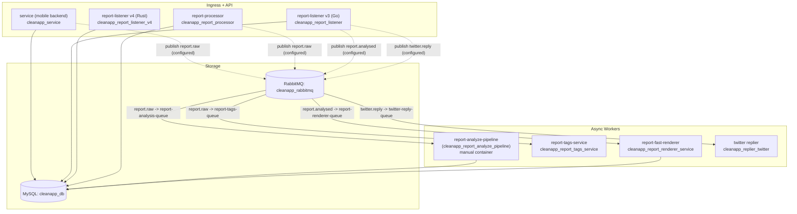

# CleanApp As-Deployed Architecture (Prod VM Xray)

Snapshot date: **2026-02-07**  
Prod VM: `cleanapp-prod` (`34.122.15.16`)

This document describes what is *actually deployed and running* on the prod VM, based on captured artifacts under this folder (docker/compose/nginx/rabbitmq health+topology).

Related:
- `REPORT.md` (auto-generated inventory summary)
- `RUNBOOK.md` (ops procedures)

## 1. System Boundaries

Everything runs on a single GCE VM:
- `nginx` terminates TLS and routes to services over `127.0.0.1:<port>`.
- Most services run as Docker containers on the `deployer_default` bridge network.
- Some **critical containers are running outside `docker compose`** (manual `docker run` with restart policies).

## 2. Public Entry Points (Domains and Routes)

Nginx configs were captured from `/etc/nginx/conf.d/*.conf`.

### Primary domains

| Domain | Path(s) | Upstream | Notes |
|---|---|---|---|
| `cleanapp.io` | `/` | `cleanapp_frontend` (`3001`) | Next.js app |
| `cleanapp.io` | `/api/v3/*` | `cleanapp_report_listener` (`9081`) | Go/Gin report-listener (v3) |
| `cleanapp.io` | `/api/v4/*` | `cleanapp_report_listener_v4` (`9097`) | Rust/Axum report-listener (v4) |
| `cleanapp.io` | `/api/reports/*`, `/api/reports-count`, `/api/geocode` | `cleanapp_frontend` (`3001`) | Next.js API routes |
| `cleanapp.io` | `/api/*` | `cleanapp_customer_service` (`9080`) | “legacy” API routes |
| `live.cleanapp.io` | `/api/v3/*` | `cleanapp_report_listener` (`9081`) | nginx adds CORS headers |
| `live.cleanapp.io` | `/api/v4/*` | `cleanapp_report_listener_v4` (`9097`) | nginx adds CORS headers |
| `api.cleanapp.io` | `/` (HTTPS) | `cleanapp_customer_service` (`9080`) | |
| `api.cleanapp.io` | `:8080` (HTTP) | `cleanapp_service` (`8079`) | Separate nginx server block on `:8080` |
| `auth.cleanapp.io` | `/` | `cleanapp_auth_service` (`9084`) | |
| `areas.cleanapp.io` | `/` | `cleanapp_areas_service` (`9086`) | |
| `processing.cleanapp.io` | `/` | `cleanapp_report_processor` (`9087`) | |
| `renderer.cleanapp.io` | `/` | `cleanapp_report_renderer_service` (`9093`) | |
| `tags.cleanapp.io` | `/` | `cleanapp_report_tags_service` (`9098`) | |
| `voice.cleanapp.io` | `/` | `cleanapp_voice_assistant_service` (`9092`) | |
| `email.cleanapp.io` | `/` | `cleanapp_email_service` (`9089`) | |
| `embed.cleanapp.io` | `/` | `cleanapp_frontend_embedded` (`3002`) | embedded frontend |

There are also several single-purpose dashboard hostnames (e.g. `devconnect2025.cleanapp.io`, `apinewyork.cleanapp.io`, `apimontenegro.cleanapp.io`, etc) that proxy to `cleanapp-*-areas` containers.

## 3. Why Two Report Listener Services Exist

Both are active in prod, and nginx routes to each explicitly:

1. `cleanapp_report_listener` (Go/Gin)
   - Serves `/api/v3/*` and live/ws-style behavior.
   - Health endpoints observed on localhost:
     - `http://127.0.0.1:9081/health` -> 200
     - `http://127.0.0.1:9081/api/v3/reports/health` -> 200

2. `cleanapp_report_listener_v4` (Rust/Axum)
   - Serves `/api/v4/*` and publishes OpenAPI.
   - Health endpoints observed on localhost:
     - `http://127.0.0.1:9097/api/v4/health` -> 200
     - `http://127.0.0.1:9097/api/v4/openapi.json` -> 200
   - OpenAPI paths present at snapshot time:
     - `/api/v4/brands/summary`
     - `/api/v4/reports/by-brand`
     - `/api/v4/reports/by-seq`
     - `/api/v4/reports/points`

Implication: **v3 and v4 are not redundant**. v4 is a separate codebase with a narrower (but contract-defined) surface area.

## 4. Runtime Inventory (Compose vs Manual)

### Compose project state

Docker Compose project: `deployer`
- Running containers: **25**
- Exited containers: **4**
- Created (defined but not started): **2**

See `docker_compose_ps_all.json` and `docker_ps_all.tsv`.

### Critical drift: 5 services defined in compose but not managed by compose

These services exist in `/home/deployer/docker-compose.yml` but **have no compose-managed container** (because containers with those names exist outside compose):
- `cleanapp_service`
- `cleanapp_frontend`
- `cleanapp_frontend_embedded`
- `cleanapp_report_analyze_pipeline`
- `cleanapp_bluesky_analyzer`

All 5 are running as **manual containers** (`docker run`), with mixed restart policies:
- `cleanapp_service`: `restart=always`
- `cleanapp_report_analyze_pipeline`: `restart=always`
- `cleanapp_bluesky_analyzer`: `restart=always`
- `cleanapp_frontend`: `restart=no`
- `cleanapp_frontend_embedded`: `restart=no`

Additionally, `cleanapp_bluesky_now` is running manually and is not in compose at all.

This is the main reason upgrades have been fragile: the “source of truth” (`docker-compose.yml`) does not fully represent what’s actually running.

## 5. Data Plane (MySQL + RabbitMQ) and Message Flows

### MySQL

Single MySQL container:
- `cleanapp_db` (MySQL)
- Host port `3306` is bound on the VM (firewall-tag dependent for public exposure).
- Volume: `eko_mysql` (external docker volume).

### RabbitMQ

Container:
- `cleanapp_rabbitmq`

Topology snapshot (see `rabbitmq_*.tsv`):
- Exchange: `cleanapp-exchange` (direct)
- Queues:
  - `report-analysis-queue`
  - `report-tags-queue`
  - `report-renderer-queue`
  - `twitter-reply-queue`
- Bindings:
  - `report.raw` -> `report-analysis-queue`
  - `report.raw` -> `report-tags-queue`
  - `report.analysed` -> `report-renderer-queue`
  - `twitter.reply` -> `twitter-reply-queue`

### Report pipeline (as deployed)

Notes:
- The running `cleanapp_report_analyze_pipeline` container **does not** expose `RABBITMQ_ANALYSED_REPORT_ROUTING_KEY` in its env (unlike the compose file), so the `report.analysed` publisher is not proven from config alone.
- `cleanapp_report_listener` *does* carry `RABBITMQ_ANALYSED_REPORT_ROUTING_KEY`, which suggests it may be publishing `report.analysed` events after analysis is written to MySQL, but confirm in code before refactors.

## 6. Social and Background Pipelines (Deployed)

### Twitter/X pipeline (partially disabled)

Running:
- `cleanapp_news_indexer_twitter` (ingest/index)
- `cleanapp_news_analyzer_twitter` (Gemini analysis)
- `cleanapp_replier_twitter` (RabbitMQ consumer for `twitter.reply`)

Not running (exited at snapshot):
- `cleanapp_news_submitter_twitter` (would submit to `cleanapp_report_listener`)

### Bluesky pipeline (enabled)

Running:
- `cleanapp_bluesky_indexer` (ingest/index)
- `cleanapp_bluesky_analyzer` (Gemini analysis, manual container)
- `cleanapp_bluesky_submitter` (submits to `cleanapp_report_listener`)
- `cleanapp_bluesky_now` (manual worker, `bluesky_now --config /app/config/config.toml`)

## 7. Network Exposure (Reality Check)

Local listening ports on the VM were captured in `ss_listening.txt`.

Key point: many service ports bind to `0.0.0.0`, but **GCE firewall rules (tags) control what is reachable from the internet**.

Instance tags (snapshot):
- `allow-3000`, `allow-8080`, `allow-8090`, `allow-8091`, `http-server`, `https-server`

Firewall rules captured (see `gcloud_firewall_rules_*.txt`):
- Public ingress explicitly allowed:
  - `80`, `443`, `8080`, `3000`, `8090`, `8091`
- Internal ingress allowed broadly on the default VPC:
  - `default-allow-internal` from `10.128.0.0/9` to `tcp/udp 0-65535`

Operational implication: even if ports like `9080`/`9081`/`9097` are not open to the public internet, they are reachable from other VPC instances unless you bind them to localhost or tighten firewall rules.

## 8. Deployer Scripts (How Prod Is Actually Managed)

Observed on the VM under `/home/deployer` (names captured in `home_deployer_scripts.txt`):
- `up.sh` generates a temporary `.env` using `gcloud secrets versions access ...`, runs `sudo docker compose up -d --remove-orphans`, then removes `.env`.
- `down.sh` / `down1.sh` stop services.

Important: **script contents were intentionally not committed** in this repo snapshot because at least one deployer script contained hard-coded credentials. If we keep these scripts long-term, refactor them so all secrets come from Secret Manager (or equivalent) and rotate any exposed keys.

## 9. Primary Upgrade Blockers (As-Deployed)

1. **Split control plane**: core services are outside compose; compose is not the full truth.
2. **No provenance**: images are deployed by tag (`:prod`) and the running digest can’t be mapped to a git commit reliably (missing build labels).
3. **Dead config**: multiple services reference `cleanapp_report_auth_service`, but no such container exists in the deployment.
4. **Inconsistent restart behavior**: some critical containers have `restart=no` (notably the frontends).
