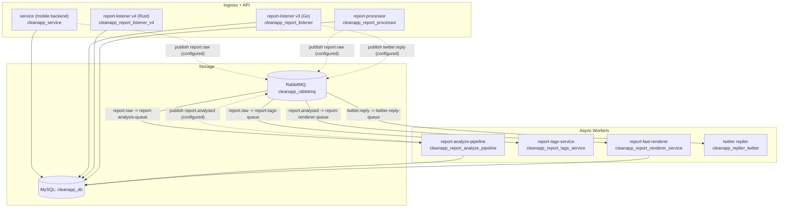

# CleanApp As-Deployed Architecture (Prod VM Xray)

Snapshot date: **2026-02-09** (post-deploy)  
Snapshot folder: `/Users/anon16/Downloads/cleanapp_back_end_v2/xray/prod/2026-02-09-postdeploy`

This document describes what is *actually deployed and running* on the prod VM, based on the captured artifacts under this folder (docker/compose/nginx/rabbitmq health+topology).

Related:
- `VERSIONS.md` (service build provenance via `/version`)
- `containers_manifest.tsv` (running containers + images)
- `platform_blueprint/manifests/prod/2026-02-09.json` (digest-pinned “what’s running” manifest)

## 1. System Boundaries

Everything runs on a single GCE VM:
- `nginx` terminates TLS and routes to services over `127.0.0.1:<port>`.
- Most services run as Docker containers on the `deployer_default` bridge network.
- As of this snapshot, the running containers are **docker-compose managed** (compose project: `deployer`, see `docker_compose_ls.txt`).

## 2. Public Entry Points (Domains and Routes)

Nginx configs were captured from `/etc/nginx/conf.d/*.conf` into `nginx_conf_d/`.

| Domain | Path(s) | Upstream | Notes |
|---|---|---|---|
| `cleanapp.io` | `/` | `cleanapp_frontend` (`3001`) | Next.js frontend |
| `cleanapp.io` | `/api/v3/*` | `cleanapp_report_listener` (`9081`) | report-listener v3 (Go/Gin) |
| `cleanapp.io` | `/api/v4/*` | `cleanapp_report_listener_v4` (`9097`) | report-listener v4 (Rust/Axum) |
| `cleanapp.io` | `/api/reports/*`, `/api/reports-count`, `/api/geocode` | `cleanapp_frontend` (`3001`) | Next.js API routes |
| `cleanapp.io` | `/api/*` | `cleanapp_customer_service` (`9080`) | “legacy” API routes |
| `live.cleanapp.io` | `/api/v3/*` | `cleanapp_report_listener` (`9081`) | nginx adds CORS headers |
| `live.cleanapp.io` | `/api/v4/*` | `cleanapp_report_listener_v4` (`9097`) | nginx adds CORS headers |
| `live.cleanapp.io` | `/` | `cleanapp_report_listener` (`9081`) | websocket-style proxy settings |
| `api.cleanapp.io` | `/` (HTTPS) | `cleanapp_customer_service` (`9080`) | |
| `api.cleanapp.io` | `:8080` (HTTP) | `cleanapp_service` (`8079`) | separate nginx server block on `:8080` |
| `auth.cleanapp.io` | `/` | `cleanapp_auth_service` (`9084`) | |
| `areas.cleanapp.io` | `/` | `cleanapp_areas_service` (`9086`) | |
| `processing.cleanapp.io` | `/` | `cleanapp_report_processor` (`9087`) | |
| `renderer.cleanapp.io` | `/` | `cleanapp_report_renderer_service` (`9093`) | |
| `tags.cleanapp.io` | `/` | `cleanapp_report_tags_service` (`9098`) | |
| `voice.cleanapp.io` | `/` | `cleanapp_voice_assistant_service` (`9092`) | |
| `email.cleanapp.io` | `/` | `cleanapp_email_service` (`9089`) | |
| `embed.cleanapp.io` | `/` | `cleanapp_frontend_embedded` (`3002`) | embedded frontend |
| `apiredbull.cleanapp.io` | `/` | `cleanapp_red_bull_dashboard` (`9085`) | brand dashboard |
| `apimontenegro.cleanapp.io` | `/` | `cleanapp_montenegro_areas` (`9083`) | custom area dashboard |
| `apinewyork.cleanapp.io` | `/` | `cleanapp_new_york_areas` (`9088`) | custom area dashboard |
| `devconnect2025.cleanapp.io` | `/` | `cleanapp_devconnect_2025_areas` (`9094`) | custom area dashboard |
| `apiedgecity.cleanapp.io` | `/` | `cleanapp_edge_city_areas` (`9095`) | custom area dashboard |

HTTP -> HTTPS redirect is handled by `cleanapp_default.conf` (captured in `nginx_conf_d/cleanapp_default.conf`).

## 3. Why Two Report Listener Services Exist (v3 vs v4)

Both are active in prod, and nginx routes to each explicitly:

1. `cleanapp_report_listener` (Go/Gin, “v3” API)
   - Serves `/api/v3/*` (and the default `live.cleanapp.io/` proxy).
   - Health endpoints captured in `http_health_status.tsv`:
     - `http://127.0.0.1:9081/health` -> 200
     - `http://127.0.0.1:9081/api/v3/reports/health` -> 200

2. `cleanapp_report_listener_v4` (Rust/Axum, “v4” API)
   - Serves `/api/v4/*` and publishes OpenAPI.
   - Health endpoints captured in `http_health_status.tsv`:
     - `http://127.0.0.1:9097/api/v4/health` -> 200
     - `http://127.0.0.1:9097/api/v4/openapi.json` -> 200 (snapshot: `api_v4_openapi.json`)

Implication: **v3 and v4 are not redundant**. They are separate codebases and are routed separately at the edge; upgrades must preserve both unless/until clients are migrated.

## 4. Runtime Inventory (What’s Running)

Running containers are listed in `docker_ps.tsv` (32 total). Full history (including exited + “*_old_20260207” containers) is in `docker_ps_all.tsv`.

Notable state at this snapshot:
- Compose project `deployer`: `running(32)` (see `docker_compose_ls.txt`).
- Several services are defined but currently exited (see `docker_ps_all.tsv`), including:
  - `cleanapp_reports_pusher` (Exited 1)
  - `cleanapp_report_ownership_service` (Exited 1)
  - `cleanapp_gdpr_process_service` (Exited 1)
  - `cleanapp_email_service_v3` (Exited 0)
  - `stxn_kickoff` (Exited 0)

## 5. Data Plane (MySQL + RabbitMQ) and Message Flows

### MySQL

Single MySQL container:
- `cleanapp_db`
- Host port `3306` is bound on the VM (see `ss_listening.txt`), but **is not tagged open to the public internet** on this instance (instance tags in `gcloud_instance_info.txt` do not include `allow-3306`).
- Volume: `eko_mysql` (external docker volume), see `docker_volume_inspect.json`.

### RabbitMQ

Container:
- `cleanapp_rabbitmq`

Topology snapshot (see `rabbitmq_*.tsv`):
- Exchange: `cleanapp-exchange` (direct)
- Queues:
  - `report-analysis-queue`
  - `report-tags-queue`
  - `report-renderer-queue`
  - `twitter-reply-queue`
- Bindings:
  - `report.raw` -> `report-analysis-queue`
  - `report.raw` -> `report-tags-queue`
  - `report.analysed` -> `report-renderer-queue`
  - `twitter.reply` -> `twitter-reply-queue`

### Report pipeline (as deployed)

Note: the diagram reflects *configurable intent* proven by running container env var keys + RabbitMQ bindings, but code should still be checked before refactors that change message contracts.

## 6. Network Exposure (Reality Check)

Local listening ports on the VM were captured in `ss_listening.txt`.

GCE firewall posture (captured in `gcloud_firewall_rules_*.txt` and `gcloud_instance_info.txt`):
- Instance tags: `allow-3000`, `allow-8080`, `allow-8090`, `allow-8091`, `http-server`, `https-server`
- Public ingress explicitly allowed by tag:
  - `80`, `443`, `3000`, `8080`, `8090`, `8091`
- VPC-internal ingress is broadly allowed by `default-allow-internal` (`10.128.0.0/9` to `tcp/udp 0-65535`)

Operational implication:
- Even if ports like `9080`/`9081`/`9097` are not open to the public internet, they are reachable from other VPC instances unless you bind them to localhost or tighten firewall rules.

